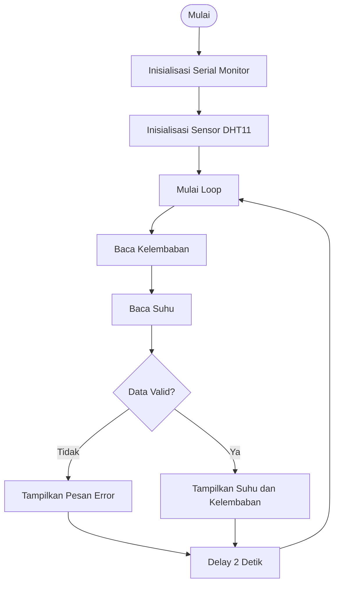
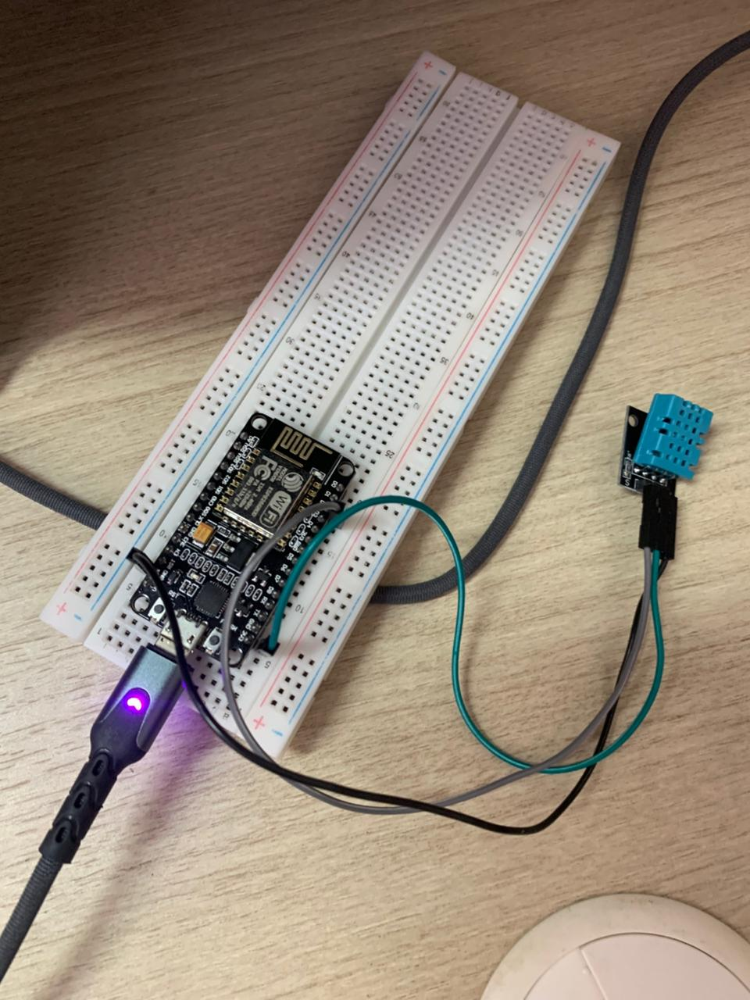
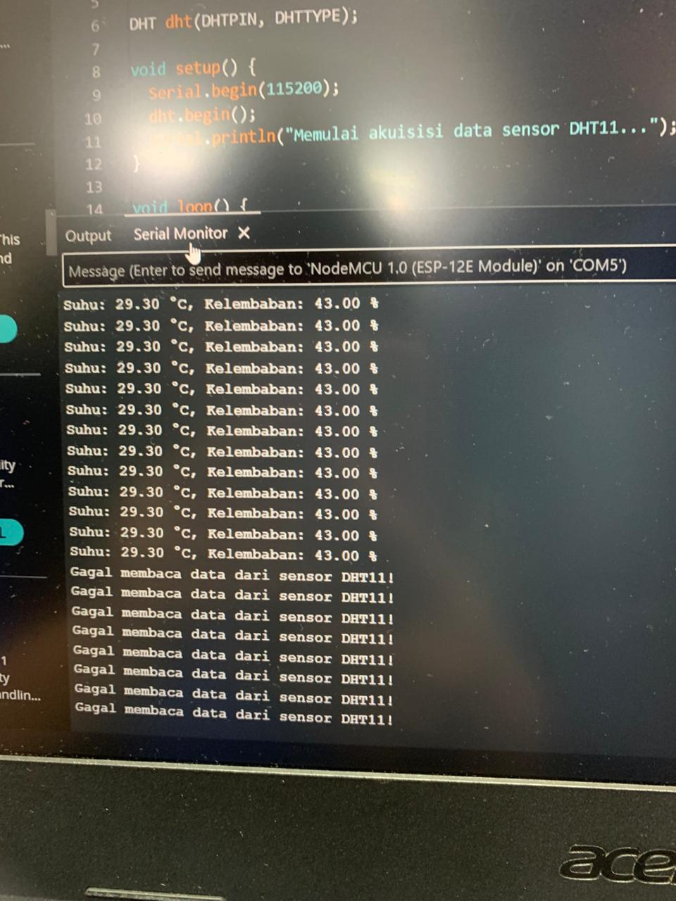

# Percobaan 1A — Akuisisi Data Sensor DHT11

##  Deskripsi Percobaan

Percobaan ini bertujuan untuk melakukan akuisisi data suhu dan kelembaban menggunakan sensor DHT. Pada modul praktikum, perangkat yang digunakan adalah ESP32 dan sensor DHT22. Namun, karena keterbatasan ketersediaan komponen di laboratorium, pada pelaksanaan praktikum dilakukan penyesuaian menggunakan **NodeMCU ESP8266** dan **sensor DHT11**.

NodeMCU digunakan untuk membaca data suhu dan kelembaban dari sensor DHT11. Data yang berhasil dibaca kemudian ditampilkan pada **Serial Monitor** setiap 2 detik.

Selain program utama, dilakukan juga modifikasi program untuk menghitung rata-rata suhu dan kelembaban dari 5 kali pembacaan data yang valid.

---

##  Tujuan Percobaan

Tujuan dari percobaan ini adalah:

1. Memahami proses akuisisi data sensor pada sistem IoT.
2. Memahami cara membaca data suhu dan kelembaban menggunakan sensor DHT11.
3. Mengimplementasikan komunikasi antara NodeMCU ESP8266 dengan sensor DHT11.
4. Menampilkan hasil pembacaan sensor pada Serial Monitor.
5. Memahami penggunaan fungsi `isnan()` untuk mendeteksi kegagalan pembacaan sensor.
6. Mengimplementasikan perhitungan rata-rata dari beberapa hasil pembacaan sensor.

---

##  Komponen yang Digunakan

| No | Komponen | Jumlah |
|---|---|---|
| 1 | NodeMCU ESP8266 | 1 |
| 2 | Sensor DHT11 | 1 |
| 3 | Breadboard | 1 |
| 4 | Kabel Jumper | Secukupnya |
| 5 | Kabel USB | 1 |

---

##  Konfigurasi Rangkaian

Konfigurasi pin antara NodeMCU ESP8266 dan sensor DHT11 adalah sebagai berikut:

| Komponen | Pin | Terhubung ke NodeMCU |
|---|---|---|
| DHT11 | VCC | 3.3V |
| DHT11 | DATA | D4 (GPIO2) |
| DHT11 | GND | GND |

### Diagram Rangkaian

```text
       NodeMCU ESP8266
       ┌────────────────┐
       │                │
       │  3.3V ─────────┼──── VCC
       │                │
       │  D4 (GPIO2) ───┼──── DATA
       │                │
       │  GND ──────────┼──── GND
       │                │
       └────────────────┘
                    │
                 DHT11
```

> **Catatan:** Pada modul awal digunakan ESP32 dan DHT22. Namun, saat praktikum dilakukan penyesuaian menggunakan NodeMCU ESP8266 dan DHT11 karena keterbatasan komponen yang tersedia di laboratorium.

---

#  Program Utama

```cpp
#include <DHT.h>

#define DHTPIN D4       // GPIO2 di NodeMCU
#define DHTTYPE DHT11   // Sensor yang digunakan

DHT dht(DHTPIN, DHTTYPE);

void setup() {
  Serial.begin(115200);
  dht.begin();

  Serial.println("Memulai akuisisi data sensor DHT11...");
}

void loop() {
  float kelembaban = dht.readHumidity();
  float suhu = dht.readTemperature();

  if (isnan(kelembaban) || isnan(suhu)) {
    Serial.println("Gagal membaca data dari sensor DHT11!");
  } else {
    Serial.print("Suhu: ");
    Serial.print(suhu);

    Serial.print(" °C, Kelembaban: ");
    Serial.print(kelembaban);

    Serial.println(" %");
  }

  delay(2000);
}
```

---

#  Library dan Dependencies

Program ini menggunakan library:

```cpp
#include <DHT.h>
```

Library `DHT.h` digunakan untuk melakukan komunikasi dengan sensor DHT dan membaca data suhu serta kelembaban.

Beberapa fungsi utama yang digunakan adalah:

| Fungsi | Keterangan |
|---|---|
| `dht.begin()` | Menginisialisasi sensor DHT |
| `dht.readTemperature()` | Membaca nilai suhu dalam satuan derajat Celsius |
| `dht.readHumidity()` | Membaca nilai kelembaban dalam persen |
| `isnan()` | Memeriksa apakah hasil pembacaan menghasilkan nilai NaN |

Library dapat diinstal melalui **Arduino Library Manager** dengan mencari:

```text
DHT sensor library
```

---

#  Penjelasan Program

## 1. Memasukkan Library

```cpp
#include <DHT.h>
```

Baris ini digunakan untuk memanggil library DHT agar program dapat berkomunikasi dengan sensor DHT11.

## 2. Menentukan Pin Sensor

```cpp
#define DHTPIN D4
```

Baris ini mendefinisikan bahwa pin DATA dari sensor DHT11 terhubung ke pin D4 pada NodeMCU ESP8266.

Pin D4 pada NodeMCU ESP8266 memiliki GPIO2.

## 3. Menentukan Tipe Sensor

```cpp
#define DHTTYPE DHT11
```

Baris ini menentukan jenis sensor yang digunakan, yaitu DHT11.

Penyesuaian ini dilakukan karena pada pelaksanaan praktikum sensor yang tersedia adalah DHT11, bukan DHT22 seperti yang tercantum pada modul.

## 4. Membuat Objek Sensor

```cpp
DHT dht(DHTPIN, DHTTYPE);
```

Baris ini membuat objek bernama `dht` dengan konfigurasi pin dan tipe sensor yang telah ditentukan sebelumnya.

Objek ini nantinya digunakan untuk mengakses fungsi pembacaan suhu dan kelembaban.

---

#  Penjelasan Fungsi `setup()`

```cpp
void setup() {
  Serial.begin(115200);
  dht.begin();

  Serial.println("Memulai akuisisi data sensor DHT11...");
}
```

Fungsi `setup()` dijalankan satu kali ketika NodeMCU pertama kali dinyalakan atau di-reset.

### `Serial.begin(115200)`

Digunakan untuk memulai komunikasi serial dengan baud rate sebesar 115200.

Komunikasi ini digunakan untuk menampilkan hasil pembacaan sensor pada Serial Monitor.

### `dht.begin()`

Digunakan untuk menginisialisasi sensor DHT11 agar sensor siap digunakan untuk melakukan pembacaan data.

### `Serial.println()`

Digunakan untuk menampilkan pesan awal pada Serial Monitor sebagai indikator bahwa proses akuisisi data sensor telah dimulai.

---

#  Penjelasan Fungsi `loop()`

Fungsi `loop()` akan dijalankan secara terus-menerus selama NodeMCU aktif.

Pada fungsi ini dilakukan proses:

1. Membaca kelembaban.
2. Membaca suhu.
3. Memeriksa validitas data.
4. Menampilkan data pada Serial Monitor.
5. Memberikan jeda sebelum pembacaan berikutnya.

## Membaca Kelembaban

```cpp
float kelembaban = dht.readHumidity();
```

Baris ini digunakan untuk membaca nilai kelembaban dari sensor DHT11.

Nilai hasil pembacaan disimpan dalam variabel `kelembaban` dengan tipe data `float`.

## Membaca Suhu

```cpp
float suhu = dht.readTemperature();
```

Baris ini digunakan untuk membaca nilai suhu dari sensor DHT11 dalam satuan derajat Celsius.

Nilai hasil pembacaan disimpan dalam variabel `suhu`.

---

#  Penjelasan Percabangan / Conditional

Program menggunakan percabangan `if-else`:

```cpp
if (isnan(kelembaban) || isnan(suhu)) {
  Serial.println("Gagal membaca data dari sensor DHT11!");
} else {
  Serial.print("Suhu: ");
  Serial.print(suhu);

  Serial.print(" °C, Kelembaban: ");
  Serial.print(kelembaban);

  Serial.println(" %");
}
```

Conditional tersebut digunakan untuk memeriksa apakah data suhu dan kelembaban berhasil dibaca dengan benar.

### Kondisi Pertama

```cpp
if (isnan(kelembaban) || isnan(suhu))
```

Jika salah satu data menghasilkan nilai `NaN`, maka program akan menampilkan pesan:

```text
Gagal membaca data dari sensor DHT11!
```

Operator `||` berarti **OR**, sehingga apabila salah satu data gagal dibaca, kondisi dianggap benar.

### Kondisi Kedua

```cpp
else
```

Apabila data suhu dan kelembaban berhasil dibaca, maka program akan menampilkan hasil pembacaan pada Serial Monitor.

Contoh output:

```text
Suhu: 28.10 °C, Kelembaban: 52 %
```

---

# ⏱️ Fungsi `delay()`

```cpp
delay(2000);
```

Baris ini memberikan jeda selama 2000 milidetik atau 2 detik sebelum sensor melakukan pembacaan berikutnya.

Dengan demikian, data sensor ditampilkan setiap 2 detik.

---

#  Flowchart Program



---

#  Hasil Pengamatan

Hasil pembacaan sensor DHT11 selama percobaan adalah sebagai berikut:

| No | Waktu | Kondisi Sensor | Suhu (°C) | Kelembaban (%) | Status |
|---|---|---|---:|---:|---|
| 1 | 00:00 | Kondisi normal | 28.10 | 52 | Valid |
| 2 | 00:02 | Sensor didekatkan ke api | 49.80 | 16 | Valid |
| 3 | 00:04 | Sensor didekatkan ke AC | 26.70 | 49 | Valid |

Berdasarkan hasil pengujian, sensor mampu membaca perubahan suhu dan kelembaban sesuai dengan kondisi lingkungan.

Pada kondisi normal, pembacaan sensor menunjukkan nilai suhu dan kelembaban yang relatif stabil. Ketika sensor didekatkan ke sumber panas, nilai suhu meningkat. Sebaliknya, ketika sensor didekatkan ke AC, suhu mengalami penurunan.

Pada proses pengujian juga sempat terjadi kegagalan pembacaan dengan hasil `NaN`. Hal tersebut diduga terjadi karena koneksi pada breadboard kurang stabil sehingga kabel data kemungkinan mengalami kontak yang kurang baik.

---

#  Modifikasi Program — Rata-rata 5 Kali Pembacaan

Selain program utama, dilakukan modifikasi program untuk menghitung rata-rata suhu dan kelembaban berdasarkan 5 kali pembacaan sensor.

```cpp
#include <DHT.h>

#define DHTPIN D4
#define DHTTYPE DHT11

DHT dht(DHTPIN, DHTTYPE);

void setup() {
  Serial.begin(115200);
  dht.begin();
}

void loop() {
  float totalSuhu = 0;
  float totalKelembaban = 0;

  int jumlahValid = 0;

  for (int i = 0; i < 5; i++) {
    float suhu = dht.readTemperature();
    float kelembaban = dht.readHumidity();

    if (!isnan(suhu) && !isnan(kelembaban)) {
      totalSuhu += suhu;
      totalKelembaban += kelembaban;

      jumlahValid++;
    }

    delay(2000);
  }

  if (jumlahValid > 0) {
    float rataSuhu = totalSuhu / jumlahValid;
    float rataKelembaban = totalKelembaban / jumlahValid;

    Serial.print("Rata-rata Suhu: ");
    Serial.print(rataSuhu);

    Serial.print(" C, Rata-rata Kelembaban: ");
    Serial.println(rataKelembaban);

  } else {
    Serial.println("Semua pembacaan gagal!");
  }
}
```

## Penjelasan Modifikasi

Pada program modifikasi digunakan perulangan:

```cpp
for (int i = 0; i < 5; i++)
```

Perulangan tersebut digunakan untuk melakukan pembacaan sensor sebanyak 5 kali.

Setiap data yang valid akan ditambahkan ke variabel `totalSuhu` dan `totalKelembaban`.

Variabel `jumlahValid` digunakan untuk menghitung jumlah data yang berhasil dibaca.

Setelah 5 kali pembacaan selesai, rata-rata dihitung menggunakan:

```cpp
float rataSuhu = totalSuhu / jumlahValid;
float rataKelembaban = totalKelembaban / jumlahValid;
```

Penggunaan rata-rata bertujuan agar hasil pembacaan lebih stabil karena satu pembacaan yang sedikit meleset tidak terlalu memengaruhi hasil akhir.

---

#  Jawaban Pertanyaan Praktikum

## 1. Bagaimana flowchart proses akuisisi data sensor DHT11?

Proses dimulai dengan menginisialisasi komunikasi Serial dan sensor DHT11. Selanjutnya program masuk ke fungsi `loop()` untuk membaca data suhu dan kelembaban.

Setelah data dibaca, program memeriksa apakah hasil pembacaan valid menggunakan fungsi `isnan()`. Jika data tidak valid, program menampilkan pesan error. Jika data valid, suhu dan kelembaban ditampilkan pada Serial Monitor.

Setelah itu program memberikan jeda selama 2 detik dan proses pembacaan diulang kembali secara terus-menerus.

## 2. Apa fungsi perintah `isnan()`?

Fungsi `isnan()` (*is not a number*) digunakan untuk memeriksa apakah hasil pembacaan sensor valid atau tidak.

Jika sensor DHT11 gagal membaca data, misalnya karena koneksi kabel kurang baik, masalah komunikasi, atau kesalahan pembacaan sensor, maka fungsi `dht.readTemperature()` atau `dht.readHumidity()` dapat menghasilkan nilai `NaN` (*Not a Number*).

Dengan menggunakan `isnan()`, program dapat mendeteksi kegagalan pembacaan sebelum data yang tidak valid ditampilkan atau digunakan dalam proses selanjutnya.

## 3. Mengapa diperlukan delay minimal 2 detik?

Sensor DHT memiliki keterbatasan kecepatan sampling. Sensor membutuhkan waktu untuk melakukan proses pengukuran internal sebelum pembacaan berikutnya dilakukan.

Apabila sensor dibaca terlalu cepat, data yang dihasilkan dapat menjadi tidak akurat atau bahkan menghasilkan nilai `NaN`.

Pada program ini digunakan:

```cpp
delay(2000);
```

atau jeda selama 2 detik agar pembacaan sensor dapat dilakukan dengan lebih aman dan stabil.

## 4. Bagaimana modifikasi program untuk menghitung rata-rata dari 5 kali pembacaan?

Program dimodifikasi menggunakan perulangan `for` sebanyak 5 kali untuk mengambil 5 sampel suhu dan kelembaban.

Setiap data yang valid akan dijumlahkan ke variabel `totalSuhu` dan `totalKelembaban`. Jumlah data valid juga dihitung menggunakan variabel `jumlahValid`.

Setelah seluruh proses pembacaan selesai, nilai total dibagi dengan jumlah data valid untuk mendapatkan nilai rata-rata.

Pendekatan ini membuat hasil pembacaan menjadi lebih stabil karena pembacaan yang sesekali meleset tidak terlalu memengaruhi hasil akhir.

---

#  Kendala yang Dihadapi

Beberapa kendala yang terjadi selama pelaksanaan percobaan antara lain:

1. Keterbatasan jumlah komponen di laboratorium menyebabkan kelompok tidak menggunakan ESP32 dan DHT22 seperti pada modul.
2. Sebagai penyesuaian, digunakan NodeMCU ESP8266 dan sensor DHT11.
3. Breadboard yang digunakan memiliki beberapa titik koneksi yang kurang stabil.
4. Setelah sensor disentuh atau diuji, pembacaan sempat menghasilkan nilai `NaN` secara terus-menerus.
5. Kemungkinan penyebab utama kegagalan pembacaan adalah koneksi kabel data yang kurang baik.
6. Sensor DHT yang digunakan sempat berganti karena digunakan secara bergantian dengan kelompok lain, sehingga terdapat sedikit perbedaan hasil pembacaan antar sensor.

---

#  Dokumentasi Praktikum

## Perangkaian Hardware



## Hasil Serial Monitor



---

#  Kesimpulan

Pada percobaan ini berhasil dilakukan proses akuisisi data suhu dan kelembaban menggunakan sensor DHT11 dan NodeMCU ESP8266.

Program mampu membaca data suhu dan kelembaban, kemudian menampilkannya melalui Serial Monitor setiap 2 detik. Program juga menggunakan fungsi `isnan()` untuk mendeteksi apabila terjadi kegagalan pembacaan sensor.

Selain itu, dilakukan modifikasi program untuk menghitung rata-rata dari 5 kali pembacaan data yang valid. Modifikasi tersebut menunjukkan bahwa beberapa hasil pembacaan dapat diolah kembali untuk memperoleh data yang lebih stabil.

Meskipun terdapat penyesuaian perangkat dari ESP32 dan DHT22 menjadi NodeMCU ESP8266 dan DHT11 karena keterbatasan komponen, tujuan utama percobaan mengenai proses akuisisi data sensor tetap dapat dilakukan.
