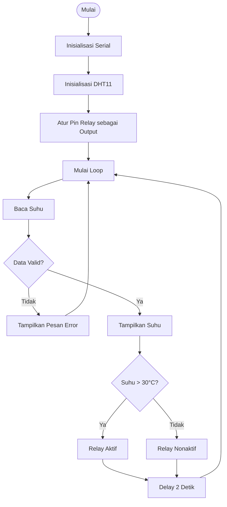
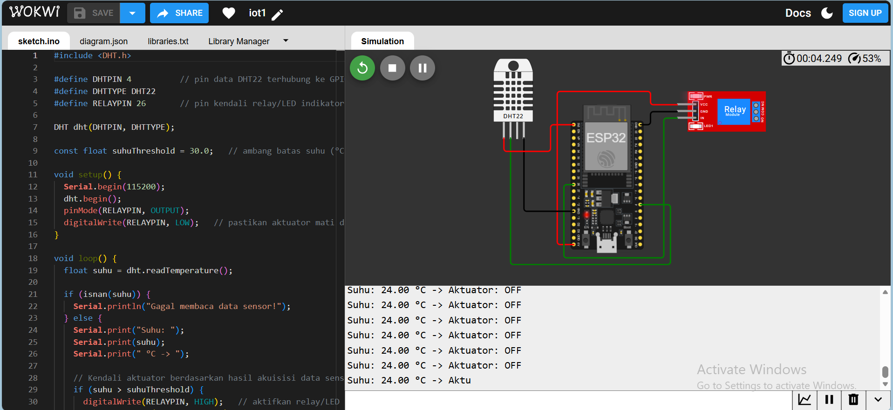
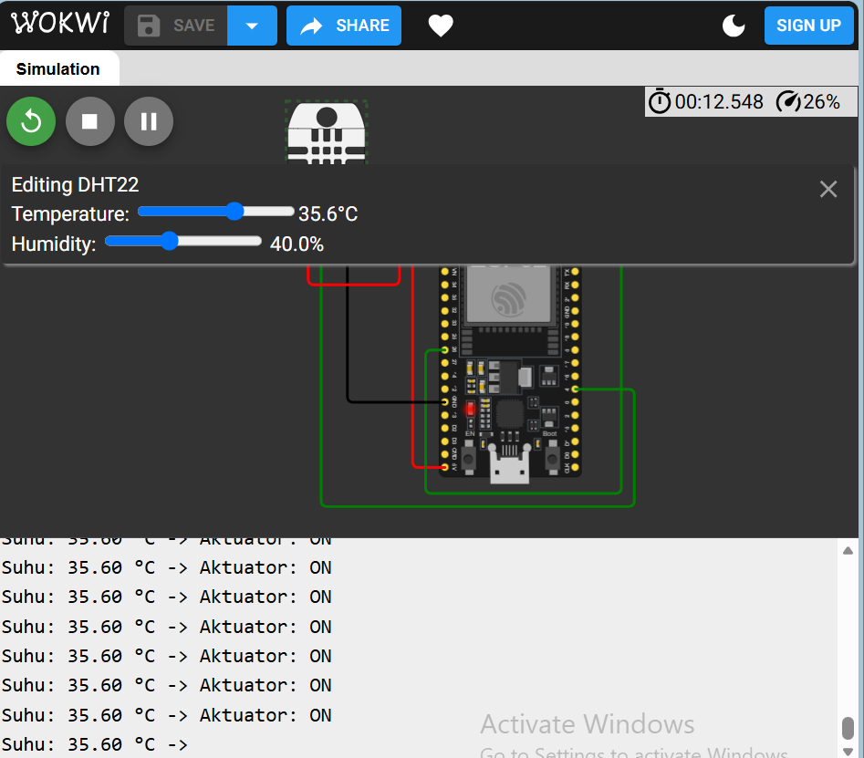

# Percobaan 2A — Kendali Aktuator Relay Berdasarkan Data Sensor

##  Deskripsi Percobaan

Percobaan ini bertujuan untuk mengimplementasikan sistem kendali aktuator berdasarkan data yang diperoleh dari sensor suhu.

Sensor DHT11 digunakan untuk membaca nilai suhu lingkungan. Data suhu tersebut kemudian digunakan sebagai input untuk menentukan kondisi relay. Relay berfungsi sebagai aktuator yang dapat dikendalikan secara otomatis berdasarkan nilai suhu yang telah ditentukan.

Pada percobaan ini, program menggunakan konsep percabangan `if-else` untuk menentukan apakah relay harus aktif atau nonaktif berdasarkan nilai suhu hasil pembacaan sensor.

Selain program utama, dilakukan juga modifikasi menggunakan metode **hysteresis** untuk mencegah relay terlalu sering berubah kondisi ketika nilai suhu berada di sekitar batas threshold.

---

##  Tujuan Percobaan

Tujuan dari percobaan ini adalah:

1. Memahami konsep kendali aktuator berdasarkan data sensor.
2. Menghubungkan sensor DHT11 dengan NodeMCU ESP8266.
3. Mengendalikan relay secara otomatis berdasarkan nilai suhu.
4. Memahami penggunaan percabangan `if-else` dalam sistem kendali.
5. Memahami konsep nilai threshold dalam pengendalian aktuator.
6. Mengimplementasikan metode hysteresis untuk mencegah relay sering aktif dan nonaktif.

---

##  Komponen yang Digunakan

| No | Komponen | Jumlah |
|---|---|---|
| 1 | NodeMCU ESP8266 | 1 |
| 2 | Sensor DHT11 | 1 |
| 3 | Modul Relay | 1 |
| 4 | Breadboard | 1 |
| 5 | Kabel Jumper | Secukupnya |
| 6 | Kabel USB | 1 |

---

##  Konfigurasi Rangkaian

Konfigurasi koneksi komponen yang digunakan adalah sebagai berikut:

### Sensor DHT11

| Pin DHT11 | Terhubung ke NodeMCU |
|---|---|
| VCC | 3.3V |
| DATA | D4 (GPIO2) |
| GND | GND |

### Modul Relay

| Pin Relay | Terhubung ke NodeMCU |
|---|---|
| VCC | VIN / 5V |
| IN | D2 (GPIO4) |
| GND | GND |

> **Catatan:** Konfigurasi pin disesuaikan dengan rangkaian yang digunakan saat praktikum.

---

##  Diagram Rangkaian

```text
                    NodeMCU ESP8266
                 ┌────────────────────┐
                 │                    │
                 │  3.3V ─────────────┼──── DHT11 VCC
                 │  D4 ───────────────┼──── DHT11 DATA
                 │  GND ──────────────┼──── DHT11 GND
                 │                    │
                 │  D2 ───────────────┼──── Relay IN
                 │  VIN ──────────────┼──── Relay VCC
                 │  GND ──────────────┼──── Relay GND
                 │                    │
                 └────────────────────┘
```

---

#  Program Utama

```cpp
#include <DHT.h>

#define DHTPIN D4
#define DHTTYPE DHT11
#define RELAY_PIN D2

DHT dht(DHTPIN, DHTTYPE);

void setup() {
  Serial.begin(115200);

  dht.begin();

  pinMode(RELAY_PIN, OUTPUT);

  digitalWrite(RELAY_PIN, LOW);

  Serial.println("Sistem kendali relay berdasarkan suhu dimulai...");
}

void loop() {
  float suhu = dht.readTemperature();

  if (isnan(suhu)) {
    Serial.println("Gagal membaca sensor DHT11!");
    return;
  }

  Serial.print("Suhu: ");
  Serial.print(suhu);
  Serial.println(" °C");

  if (suhu > 30) {
    digitalWrite(RELAY_PIN, HIGH);
    Serial.println("Relay AKTIF");
  } else {
    digitalWrite(RELAY_PIN, LOW);
    Serial.println("Relay NONAKTIF");
  }

  delay(2000);
}
```

---

#  Library dan Dependencies

Program menggunakan library:

```cpp
#include <DHT.h>
```

Library `DHT.h` digunakan untuk membaca data dari sensor DHT11.

Library tersebut menyediakan beberapa fungsi utama, seperti:

| Fungsi | Keterangan |
|---|---|
| `dht.begin()` | Menginisialisasi sensor DHT |
| `dht.readTemperature()` | Membaca nilai suhu |
| `dht.readHumidity()` | Membaca nilai kelembaban |
| `isnan()` | Memeriksa apakah data hasil pembacaan valid |

Library dapat diinstal melalui **Arduino IDE Library Manager** dengan mencari:

```text
DHT sensor library
```

---

#  Penjelasan Program

## 1. Memasukkan Library

```cpp
#include <DHT.h>
```

Baris tersebut digunakan untuk memanggil library DHT agar NodeMCU dapat berkomunikasi dengan sensor DHT11.

---

## 2. Mendefinisikan Pin

```cpp
#define DHTPIN D4
#define DHTTYPE DHT11
#define RELAY_PIN D2
```

Penjelasan:

- `DHTPIN D4` digunakan untuk menentukan pin DATA sensor DHT11.
- `DHTTYPE DHT11` digunakan untuk menentukan jenis sensor yang digunakan.
- `RELAY_PIN D2` digunakan untuk menentukan pin yang mengendalikan modul relay.

---

## 3. Membuat Objek Sensor

```cpp
DHT dht(DHTPIN, DHTTYPE);
```

Baris tersebut membuat objek bernama `dht`.

Objek `dht` digunakan untuk mengakses fungsi-fungsi dari library DHT, seperti membaca suhu dan kelembaban.

---

#  Penjelasan Fungsi `setup()`

```cpp
void setup() {
  Serial.begin(115200);

  dht.begin();

  pinMode(RELAY_PIN, OUTPUT);

  digitalWrite(RELAY_PIN, LOW);

  Serial.println("Sistem kendali relay berdasarkan suhu dimulai...");
}
```

Fungsi `setup()` hanya dijalankan satu kali ketika NodeMCU pertama kali dinyalakan atau di-reset.

---

## `Serial.begin(115200)`

```cpp
Serial.begin(115200);
```

Digunakan untuk memulai komunikasi serial dengan baud rate 115200.

Komunikasi serial digunakan untuk menampilkan informasi suhu dan status relay pada Serial Monitor.

---

## `dht.begin()`

```cpp
dht.begin();
```

Digunakan untuk menginisialisasi sensor DHT11 sebelum sensor digunakan untuk membaca data.

---

## `pinMode()`

```cpp
pinMode(RELAY_PIN, OUTPUT);
```

Digunakan untuk mengatur pin relay sebagai pin output.

Hal ini diperlukan karena NodeMCU akan mengirimkan sinyal digital ke modul relay.

---

## `digitalWrite()`

```cpp
digitalWrite(RELAY_PIN, LOW);
```

Digunakan untuk memberikan kondisi awal pada relay.

Pada kondisi awal, relay diatur dalam keadaan nonaktif.

---

#  Penjelasan Fungsi `loop()`

Fungsi `loop()` dijalankan secara terus-menerus selama NodeMCU aktif.

Pada fungsi ini dilakukan beberapa proses:

1. Membaca data suhu dari DHT11.
2. Memeriksa apakah data berhasil dibaca.
3. Menampilkan nilai suhu pada Serial Monitor.
4. Membandingkan suhu dengan nilai threshold.
5. Mengaktifkan atau menonaktifkan relay.
6. Memberikan jeda sebelum pembacaan berikutnya.

---

## Membaca Suhu

```cpp
float suhu = dht.readTemperature();
```

Baris tersebut digunakan untuk membaca nilai suhu dari sensor DHT11.

Nilai hasil pembacaan disimpan ke dalam variabel `suhu` dengan tipe data `float`.

---

#  Penjelasan Percabangan / Conditional

Program menggunakan beberapa percabangan `if-else`.

## 1. Memeriksa Validitas Data Sensor

```cpp
if (isnan(suhu)) {
  Serial.println("Gagal membaca sensor DHT11!");
  return;
}
```

Percabangan tersebut digunakan untuk memastikan bahwa data suhu berhasil dibaca.

Apabila hasil pembacaan menghasilkan nilai `NaN`, maka program akan menampilkan pesan error.

Perintah:

```cpp
return;
```

digunakan untuk menghentikan proses pada iterasi `loop()` tersebut dan kembali memulai proses pembacaan pada iterasi berikutnya.

---

## 2. Conditional untuk Mengendalikan Relay

```cpp
if (suhu > 30) {
  digitalWrite(RELAY_PIN, HIGH);
  Serial.println("Relay AKTIF");
} else {
  digitalWrite(RELAY_PIN, LOW);
  Serial.println("Relay NONAKTIF");
}
```

Conditional tersebut merupakan inti dari sistem kendali aktuator.

### Kondisi Pertama

```cpp
if (suhu > 30)
```

Apabila suhu lebih dari 30°C, maka relay akan diaktifkan.

```cpp
digitalWrite(RELAY_PIN, HIGH);
```

NodeMCU akan mengirimkan sinyal digital ke pin relay.

---

### Kondisi Kedua

```cpp
else
```

Apabila suhu kurang dari atau sama dengan 30°C, relay akan dinonaktifkan.

```cpp
digitalWrite(RELAY_PIN, LOW);
```

Dengan demikian, relay bekerja berdasarkan nilai suhu yang dibaca oleh sensor.

---

#  Penjelasan Konsep Threshold

Threshold merupakan nilai batas yang digunakan sebagai acuan dalam pengambilan keputusan.

Pada percobaan ini digunakan batas suhu:

```text
30°C
```

Logika sistem:

| Kondisi Suhu | Status Relay |
|---|---|
| Suhu > 30°C | Relay Aktif |
| Suhu ≤ 30°C | Relay Nonaktif |

Dengan konsep tersebut, NodeMCU dapat mengambil keputusan secara otomatis berdasarkan data sensor.

---

#  Fungsi `delay()`

```cpp
delay(2000);
```

Perintah tersebut memberikan jeda selama 2 detik sebelum sensor melakukan pembacaan berikutnya.

Jeda digunakan agar pembacaan sensor dilakukan dengan interval yang stabil.

---

#  Flowchart Program



---

#  Hasil Percobaan

Pada percobaan ini dilakukan pengujian dengan mengamati perubahan status relay berdasarkan perubahan suhu yang dibaca oleh sensor DHT11.

| Kondisi | Suhu | Status Relay |
|---|---:|---|
| Suhu normal | ≤ 30°C | Nonaktif |
| Suhu meningkat | > 30°C | Aktif |
| Suhu kembali turun | ≤ 30°C | Nonaktif |

Berdasarkan hasil percobaan, relay dapat dikendalikan secara otomatis menggunakan data suhu dari sensor.

Ketika suhu melewati nilai threshold yang telah ditentukan, NodeMCU mengaktifkan relay. Sebaliknya, ketika suhu berada di bawah batas threshold, relay dinonaktifkan.

Hal tersebut menunjukkan konsep dasar sistem IoT, yaitu data dari sensor dapat digunakan sebagai dasar untuk melakukan pengambilan keputusan dan mengendalikan perangkat output secara otomatis.

---

#  Modifikasi Program — Implementasi Hysteresis

Selain menggunakan satu nilai threshold, program dimodifikasi menggunakan metode **hysteresis**.

Metode hysteresis menggunakan dua batas suhu:

- Batas atas: **30°C**
- Batas bawah: **28°C**

Relay akan:

- Aktif ketika suhu mencapai atau melebihi 30°C.
- Tetap aktif ketika suhu berada di antara 28°C sampai 30°C.
- Nonaktif ketika suhu turun hingga atau di bawah 28°C.

---

## Program Hysteresis

```cpp
#include <DHT.h>

#define DHTPIN D4
#define DHTTYPE DHT11
#define RELAY_PIN D2

DHT dht(DHTPIN, DHTTYPE);

bool relayStatus = false;

void setup() {
  Serial.begin(115200);

  dht.begin();

  pinMode(RELAY_PIN, OUTPUT);

  digitalWrite(RELAY_PIN, LOW);

  Serial.println("Sistem kendali relay dengan hysteresis dimulai...");
}

void loop() {
  float suhu = dht.readTemperature();

  if (isnan(suhu)) {
    Serial.println("Gagal membaca sensor DHT11!");
    delay(2000);
    return;
  }

  if (suhu >= 30) {
    relayStatus = true;
  } 
  else if (suhu <= 28) {
    relayStatus = false;
  }

  digitalWrite(RELAY_PIN, relayStatus ? HIGH : LOW);

  Serial.print("Suhu: ");
  Serial.print(suhu);
  Serial.print(" °C | Status Relay: ");

  if (relayStatus) {
    Serial.println("AKTIF");
  } else {
    Serial.println("NONAKTIF");
  }

  delay(2000);
}
```

---

#  Penjelasan Metode Hysteresis

Pada sistem threshold biasa, relay dapat berubah kondisi setiap kali suhu melewati batas tertentu.

Contohnya:

```text
Suhu = 29.9°C → Relay OFF
Suhu = 30.1°C → Relay ON
Suhu = 29.9°C → Relay OFF
Suhu = 30.1°C → Relay ON
```

Apabila nilai sensor mengalami perubahan kecil di sekitar batas threshold, relay dapat terus-menerus berubah kondisi.

Kondisi tersebut dapat menyebabkan relay terlalu sering aktif dan nonaktif.

Untuk mengatasi masalah tersebut digunakan metode hysteresis.

Pada program ini terdapat dua batas:

```text
Batas Atas = 30°C
Batas Bawah = 28°C
```

Logikanya:

```text
Jika suhu ≥ 30°C
→ Relay ON

Jika suhu ≤ 28°C
→ Relay OFF

Jika suhu berada antara 28°C sampai 30°C
→ Status relay tetap seperti sebelumnya
```

Dengan metode tersebut, relay tidak langsung berubah kondisi ketika suhu mengalami perubahan kecil di sekitar threshold.

---

# Conditional pada Program Hysteresis

Bagian utama dari hysteresis adalah:

```cpp
if (suhu >= 30) {
  relayStatus = true;
} 
else if (suhu <= 28) {
  relayStatus = false;
}
```

### Kondisi Pertama

```cpp
if (suhu >= 30)
```

Jika suhu mencapai atau lebih dari 30°C, status relay diubah menjadi aktif.

---

### Kondisi Kedua

```cpp
else if (suhu <= 28)
```

Jika suhu turun hingga atau di bawah 28°C, status relay diubah menjadi nonaktif.

---

### Suhu antara 28°C dan 30°C

Apabila suhu berada di antara 28°C dan 30°C, tidak ada perubahan pada variabel:

```cpp
relayStatus
```

Artinya relay mempertahankan kondisi sebelumnya.

Inilah konsep utama dari hysteresis.

---

#  Jawaban Pertanyaan Praktikum

## 1. Bagaimana cara mengendalikan aktuator berdasarkan data sensor?

Aktuator dapat dikendalikan dengan membaca data dari sensor terlebih dahulu. Data sensor kemudian dibandingkan dengan nilai tertentu menggunakan conditional atau percabangan.

Pada percobaan ini, nilai suhu digunakan sebagai input.

Apabila suhu melewati batas yang telah ditentukan, NodeMCU mengirimkan sinyal untuk mengaktifkan relay. Sebaliknya, apabila suhu berada di bawah batas, relay dinonaktifkan.

Secara sederhana, prosesnya adalah:

```text
Sensor → Membaca Data → Mikrokontroler Memproses → Pengambilan Keputusan → Aktuator
```

---

## 2. Apa fungsi penggunaan threshold dalam sistem kendali?

Threshold berfungsi sebagai nilai batas untuk menentukan tindakan yang harus dilakukan oleh sistem.

Dalam percobaan ini digunakan threshold suhu sebesar 30°C.

Apabila suhu lebih dari batas tersebut, relay diaktifkan. Apabila suhu berada di bawah batas, relay dinonaktifkan.

Threshold memungkinkan mikrokontroler melakukan pengambilan keputusan secara otomatis berdasarkan kondisi lingkungan.

---

## 3. Apa yang terjadi jika nilai sensor berada di sekitar threshold?

Jika sistem hanya menggunakan satu threshold, perubahan kecil pada nilai sensor dapat menyebabkan relay sering berubah kondisi.

Contohnya, apabila threshold adalah 30°C:

```text
29.9°C → Relay OFF
30.1°C → Relay ON
29.9°C → Relay OFF
30.1°C → Relay ON
```

Perubahan tersebut dapat terjadi berulang kali apabila suhu terus berfluktuasi di sekitar batas.

Untuk mengatasi masalah tersebut dapat digunakan metode hysteresis.

---

## 4. Bagaimana cara mengimplementasikan hysteresis?

Hysteresis dapat diimplementasikan dengan menggunakan dua nilai batas.

Pada percobaan ini digunakan:

```text
Batas atas = 30°C
Batas bawah = 28°C
```

Logikanya:

- Jika suhu ≥ 30°C, relay aktif.
- Jika suhu ≤ 28°C, relay nonaktif.
- Jika suhu berada di antara 28°C dan 30°C, relay mempertahankan kondisi sebelumnya.

Metode ini membuat sistem lebih stabil dan mengurangi perubahan status relay yang terlalu sering.

---

#  Kendala yang Dihadapi

Beberapa kendala yang dapat terjadi pada percobaan antara lain:

1. Pembacaan sensor dapat menghasilkan nilai `NaN` apabila koneksi sensor tidak stabil.
2. Perubahan suhu yang berada di sekitar threshold dapat menyebabkan relay sering berubah kondisi apabila hanya menggunakan satu batas.
3. Modul relay membutuhkan konfigurasi pin yang sesuai agar dapat dikendalikan dengan benar.
4. Koneksi kabel pada breadboard harus dipastikan terpasang dengan baik agar sistem dapat bekerja secara stabil.
5. Terdapat perbedaan konfigurasi perangkat apabila komponen yang digunakan saat praktikum berbeda dengan komponen pada modul.

---

#  Dokumentasi Praktikum

#  Dokumentasi Praktikum

## Perangkaian Hardware



## Hasil Serial Monitor


---

#  Kesimpulan

Pada percobaan ini berhasil diimplementasikan sistem kendali aktuator relay berdasarkan data suhu dari sensor DHT11.

NodeMCU ESP8266 membaca nilai suhu kemudian melakukan pengambilan keputusan menggunakan percabangan `if-else`. Relay akan aktif atau nonaktif בהתאם dengan kondisi suhu yang telah ditentukan.

Penggunaan threshold memungkinkan sistem melakukan kendali secara otomatis berdasarkan kondisi lingkungan.

Selain itu, implementasi metode hysteresis menggunakan batas atas 30°C dan batas bawah 28°C membuat sistem kendali menjadi lebih stabil. Relay tidak mudah berubah kondisi ketika suhu mengalami fluktuasi kecil di sekitar nilai threshold.

Percobaan ini menunjukkan hubungan antara sensor sebagai perangkat input, mikrokontroler sebagai pemroses data dan pengambil keputusan, serta relay sebagai aktuator atau perangkat output dalam sebuah sistem Internet of Things.
