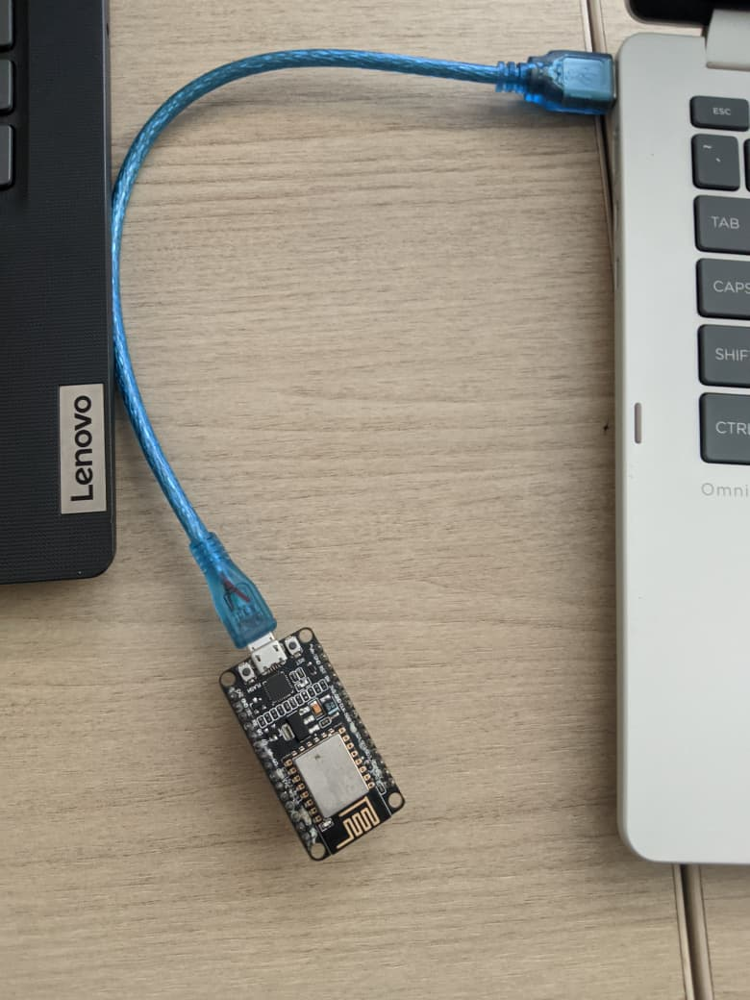
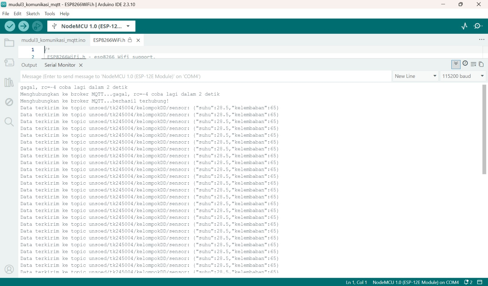

# Percobaan 3B – Komunikasi Data Menggunakan MQTT

## A. Deskripsi Percobaan

Percobaan 3B dilakukan untuk memahami dan mengimplementasikan pertukaran data menggunakan protokol MQTT dengan pola publish-subscribe dan format data JSON.

Pada praktikum ini digunakan NodeMCU ESP8266 sebagai pengganti ESP32 yang tercantum pada modul. NodeMCU terhubung ke jaringan WiFi dan kemudian melakukan koneksi ke broker MQTT publik `broker.hivemq.com`.

Data sensor berupa suhu dan kelembaban dikemas dalam format JSON kemudian dipublikasikan secara berkala ke topic MQTT. Data yang dipublikasikan diverifikasi menggunakan aplikasi client MQTT yang melakukan subscribe pada topic yang sama.

## B. Tujuan Percobaan

1. Memahami konsep dasar protokol MQTT pada sistem IoT.
2. Memahami pola komunikasi publish-subscribe.
3. Menghubungkan NodeMCU ke broker MQTT.
4. Mengirimkan data dalam format JSON melalui MQTT.
5. Memverifikasi data yang dipublikasikan menggunakan MQTT client.
6. Memahami mekanisme reconnect ketika koneksi MQTT terputus.

## C. Alat dan Bahan

- NodeMCU ESP8266
- Kabel USB
- Laptop/PC
- Arduino IDE
- Jaringan WiFi yang terhubung ke internet
- Library ESP8266WiFi
- Library PubSubClient
- Library ArduinoJson
- Broker MQTT publik `broker.hivemq.com`
- MQTT client untuk melakukan subscribe

## D. Konfigurasi Rangkaian

Gambar menunjukkan NodeMCU yang terhubung dengan laptop melalui kabel USB. Pertukaran data MQTT dilakukan melalui jaringan WiFi.

### Diagram Rangkaian

```text
Laptop/PC
    |
    | Kabel USB
    |
    v
NodeMCU ESP8266
    |
    | WiFi
    v
Broker MQTT
broker.hivemq.com
    |
    v
MQTT Client
```

### Dokumentasi Rangkaian



## E. Program

Program yang digunakan pada percobaan MQTT adalah:

```cpp
#include <ESP8266WiFi.h>
#include <WiFiClient.h>
#include <PubSubClient.h>
#include <ArduinoJson.h>

const char* ssid     = "NAMA_WIFI_ANDA";
const char* password = "PASSWORD_WIFI_ANDA";

const char* mqttServer = "broker.hivemq.com";
const int   mqttPort   = 1883;
const char* mqttTopic  = "unsoed/tk245004/kelompokDD/sensor";

WiFiClient espClient;
PubSubClient client(espClient);

void hubungkanWiFi() {
  WiFi.begin(ssid, password);
  Serial.print("Menghubungkan ke WiFi");

  while (WiFi.status() != WL_CONNECTED) {
    delay(500);
    Serial.print(".");
  }

  Serial.println("\nWiFi berhasil terhubung!");
}

void hubungkanMQTT() {
  while (!client.connected()) {
    Serial.print("Menghubungkan ke broker MQTT...");

    String clientId = "ESP32Client-" + String(random(0xffff), HEX);

    if (client.connect(clientId.c_str())) {
      Serial.println("berhasil terhubung!");
    } else {
      Serial.print("gagal, rc=");
      Serial.print(client.state());
      Serial.println(" coba lagi dalam 2 detik");
      delay(2000);
    }
  }
}

void setup() {
  Serial.begin(115200);
  hubungkanWiFi();
  client.setServer(mqttServer, mqttPort);
}

void loop() {
  if (!client.connected()) {
    hubungkanMQTT();
  }

  client.loop();

  // Membuat data sensor dalam format JSON
  JsonDocument doc;
  doc["suhu"] = 28.5;
  doc["kelembaban"] = 65.0;

  char buffer[128];
  serializeJson(doc, buffer);

  // Mempublikasikan data ke topic MQTT
  client.publish(mqttTopic, buffer);

  Serial.print("Data terkirim ke topic ");
  Serial.print(mqttTopic);
  Serial.print(": ");
  Serial.println(buffer);

  delay(5000);
}
```

## F. Library dan Dependencies

### 1. ESP8266WiFi

```cpp
#include <ESP8266WiFi.h>
```

Digunakan untuk menghubungkan NodeMCU ESP8266 ke jaringan WiFi.

### 2. WiFiClient

```cpp
#include <WiFiClient.h>
```

Digunakan untuk menyediakan koneksi jaringan yang digunakan oleh MQTT client.

### 3. PubSubClient

```cpp
#include <PubSubClient.h>
```

Digunakan untuk melakukan komunikasi MQTT, termasuk koneksi ke broker dan proses publish data.

### 4. ArduinoJson

```cpp
#include <ArduinoJson.h>
```

Digunakan untuk membuat data dalam format JSON.

## G. Penjelasan Program

Program memiliki fungsi `hubungkanWiFi()` yang digunakan untuk menghubungkan NodeMCU ke jaringan WiFi.

```cpp
void hubungkanWiFi()
```

Fungsi tersebut menjalankan:

```cpp
WiFi.begin(ssid, password);
```

untuk memulai koneksi WiFi.

Program akan menunggu sampai koneksi berhasil melalui:

```cpp
while (WiFi.status() != WL_CONNECTED)
```

Setelah WiFi berhasil terhubung, fungsi `hubungkanMQTT()` digunakan untuk menghubungkan NodeMCU ke broker MQTT.

```cpp
while (!client.connected())
```

akan terus melakukan pengecekan sampai client berhasil terhubung ke broker.

Client ID dibuat secara acak menggunakan:

```cpp
String clientId = "ESP32Client-" + String(random(0xffff), HEX);
```

Jika koneksi berhasil, program menampilkan pesan berhasil terhubung. Jika gagal, kode error atau `rc` ditampilkan dan program mencoba kembali setelah 2 detik.

Pada `setup()`, broker MQTT ditentukan menggunakan:

```cpp
client.setServer(mqttServer, mqttPort);
```

Pada `loop()`, koneksi MQTT diperiksa menggunakan:

```cpp
if (!client.connected()) {
  hubungkanMQTT();
}
```

Jika koneksi terputus, program akan menjalankan fungsi reconnect.

Kemudian:

```cpp
client.loop();
```

digunakan untuk menjaga koneksi MQTT tetap aktif dan memproses komunikasi dengan broker.

Data suhu dan kelembaban dibuat dalam format JSON:

```cpp
JsonDocument doc;
doc["suhu"] = 28.5;
doc["kelembaban"] = 65.0;
```

Data JSON kemudian diubah menjadi teks:

```cpp
char buffer[128];
serializeJson(doc, buffer);
```

Data tersebut dipublikasikan ke topic menggunakan:

```cpp
client.publish(mqttTopic, buffer);
```

Setelah itu informasi data yang dikirim ditampilkan pada Serial Monitor.

Program melakukan publish setiap 5 detik melalui:

```cpp
delay(5000);
```

## H. Hasil Pengamatan

Sesuai spesifikasi, NodeMCU berhasil terhubung ke broker MQTT publik dan mem-publish data JSON secara berkala ke topic yang telah ditentukan.

Percobaan koneksi awal sempat gagal dua kali dengan kode `rc=-4`, yang menunjukkan timeout saat menghubungi broker. Karena program memiliki mekanisme retry otomatis setiap 2 detik, koneksi akhirnya berhasil tanpa perlu intervensi manual.

Setelah berhasil terhubung, publikasi data berjalan stabil dan konsisten setiap 5 detik tanpa kegagalan lagi. Data JSON yang sama juga muncul pada aplikasi client MQTT yang melakukan subscribe ke topic tersebut sebagai bukti bahwa data berhasil sampai ke broker.

### Hasil Serial Monitor



## I. Pertanyaan Praktikum

### 1. Apa fungsi topic pada MQTT dan mengapa topic perlu dibuat unik?

Topic berfungsi sebagai alamat atau label pengelompokan data pada broker MQTT. Dengan adanya topic, perangkat subscriber hanya menerima data dari topic yang diikutinya.

Topic perlu dibuat unik karena broker yang digunakan merupakan broker publik yang dipakai oleh banyak pengguna. Jika topic terlalu umum, data dapat tercampur dengan data kelompok atau pengguna lain sehingga hasil pengamatan menjadi tidak valid.

Pada percobaan ini digunakan topic:

```text
unsoed/tk245004/kelompokDD/sensor
```

### 2. Apa fungsi `client.loop()` yang dipanggil pada setiap iterasi `loop()`?

`client.loop()` berfungsi menjaga koneksi MQTT tetap hidup dengan memproses paket komunikasi dan mengirimkan sinyal keepalive ke broker.

Fungsi tersebut juga digunakan untuk menangani pesan yang masuk apabila perangkat melakukan subscribe. Jika `client.loop()` tidak dipanggil secara rutin, broker dapat menganggap perangkat tidak aktif dan memutuskan koneksi.

### 3. Apa yang terjadi apabila koneksi ke broker MQTT terputus di tengah program?

Jika koneksi ke broker terputus, kondisi:

```cpp
if (!client.connected())
```

akan bernilai benar sehingga program memanggil fungsi `hubungkanMQTT()` untuk mencoba menyambung kembali.

Di dalam fungsi tersebut terdapat `while` yang terus mencoba koneksi dengan jeda 2 detik sampai berhasil. Selama koneksi belum pulih, data tidak dapat dipublikasikan ke broker.

Data yang seharusnya dikirim selama koneksi terputus dapat hilang jika program tidak menggunakan mekanisme penyimpanan sementara atau buffering.

## J. Analisis HTTP dan MQTT

Berdasarkan hasil percobaan, terdapat perbedaan pada overhead dan pola komunikasi antara HTTP dan MQTT.

Pada HTTP, satu kali pengiriman data menghasilkan response body yang jauh lebih panjang dibandingkan data asli karena response berisi berbagai informasi seperti headers, data, JSON, origin, dan URL. Hal tersebut menunjukkan overhead HTTP lebih besar.

Pada MQTT, proses publish hanya menghasilkan data JSON yang dikirimkan ke topic tanpa response panjang seperti pada HTTP.

Dari sisi pola komunikasi, HTTP menggunakan model request-response. Pada program, koneksi HTTP dibuat dan ditutup pada setiap proses pengiriman menggunakan `http.begin()` dan `http.end()`.

Sedangkan MQTT menggunakan koneksi yang tetap terjaga atau persistent connection melalui `client.loop()`, sehingga tidak perlu melakukan koneksi ulang setiap kali mengirim data.

Untuk skenario pengiriman data sensor secara terus-menerus setiap beberapa detik dalam jangka waktu lama, MQTT lebih sesuai karena memiliki overhead yang lebih kecil dan koneksi yang tetap terjaga. Pola publish-subscribe juga memudahkan beberapa perangkat untuk menerima data dari topic yang sama.

## K. Peran JSON dalam Komunikasi IoT

JSON berperan sebagai format pertukaran data yang dapat digunakan oleh berbagai perangkat dan platform. Struktur JSON menggunakan pasangan key-value sehingga data lebih mudah dibaca dan diproses.

Dalam percobaan ini, data JSON yang dikirim oleh NodeMCU dapat diterima oleh broker MQTT dan ditampilkan pada aplikasi client MQTT. Hal tersebut menunjukkan bahwa JSON dapat membantu pertukaran data antara perangkat dan aplikasi yang berbeda.

## L. Catatan Kendala

Kendala pada percobaan MQTT adalah koneksi awal ke broker yang gagal dua kali berturut-turut dengan kode `rc=-4`, yang menunjukkan timeout saat menghubungi broker publik. Hal tersebut kemungkinan disebabkan oleh jaringan WiFi lab yang kurang stabil atau broker publik yang sedang ramai diakses.

Program memiliki mekanisme retry otomatis sehingga koneksi berhasil pada percobaan berikutnya tanpa perlu melakukan upload ulang program.

Selain itu, kendala port Arduino IDE yang terjadi pada Percobaan 3A juga berpengaruh pada percobaan MQTT. Percobaan MQTT baru dapat dijalankan setelah masalah kabel USB dan port tersebut teratasi.

## K. Dokumentasi Praktikum

### Perangkaian Hardware


### Hasil Serial Monitor


## N. Kesimpulan

Percobaan 3B berhasil menerapkan komunikasi MQTT menggunakan NodeMCU ESP8266. NodeMCU berhasil terhubung ke broker MQTT publik dan mem-publish data suhu serta kelembaban dalam format JSON ke topic yang telah ditentukan.

Koneksi awal sempat mengalami kegagalan sebanyak dua kali dengan kode `rc=-4`, tetapi mekanisme retry otomatis berhasil menghubungkan kembali perangkat ke broker. Setelah terhubung, data berhasil dipublikasikan secara stabil setiap 5 detik dan dapat diverifikasi melalui aplikasi MQTT client.

Percobaan ini menunjukkan bahwa MQTT dapat digunakan untuk pertukaran data IoT dengan pola publish-subscribe dan koneksi yang tetap terjaga.
